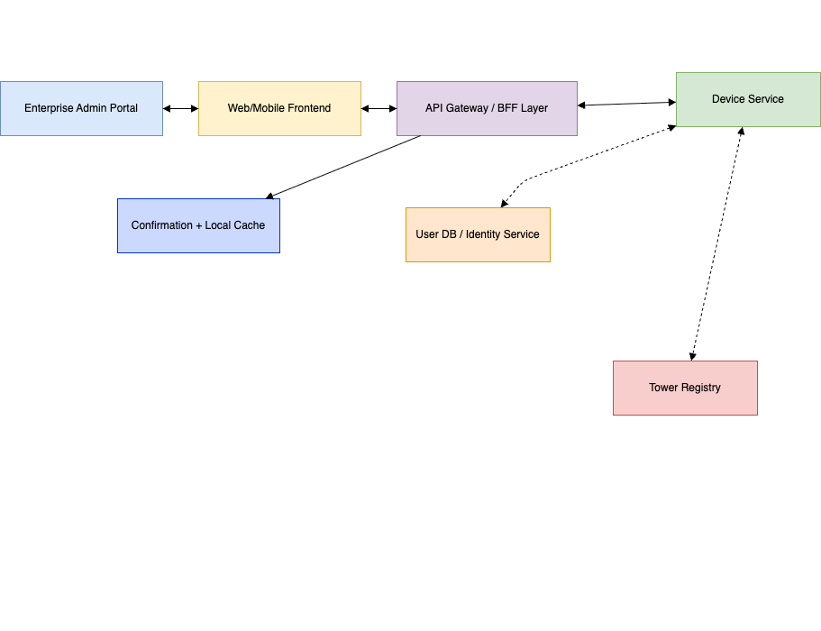

# 📲 Onboard Flow – Device & User Onboarding

This document describes the onboarding flow for users and their associated devices in the Telecom Mission Control platform. It ensures all enterprise devices and users are securely registered and validated before policy enforcement.

---

## 📊 Overview

The **Onboard Flow** enables seamless registration of users and their devices by integrating with tower registries, identity providers, and device inventory systems. It supports both manual and auto-discovery of devices.

---

## 🔁 Flow Diagram

---

## 🔧 Flow Steps

1. **Enterprise Admin or Auto-Discovery Service** detects a new user or device.
2. The **Frontend App** triggers a request to initiate onboarding.
3. The **SecureEdge Gateway** orchestrates requests to:
   - **Tower Registry Service** to validate device-carrier compatibility.
   - **Identity Provider (IdP)** to validate the user’s credentials and enterprise affiliation.
4. Upon successful validation:
   - The **User Registry** stores user metadata and links them to the validated device.
   - The **Device Service** records device information and binds it to the user.
5. The onboarding status is cached locally on the frontend for offline support.

---

## 🔄 Bi-Directional Flows

- **Frontend ↔ SecureEdge Gateway**: Status updates and validations.
- **SecureEdge Gateway ↔ Tower Registry**: Validation of supported carriers per tower.
- **SecureEdge Gateway ↔ Identity Provider**: Authentication & enterprise verification.

---

## 💼 Use Case: New Device Registration for Remote Employee

> A new field engineer joins the enterprise and turns on their company-issued phone for the first time in a remote region.

- The device is auto-discovered by the platform through cell towe
