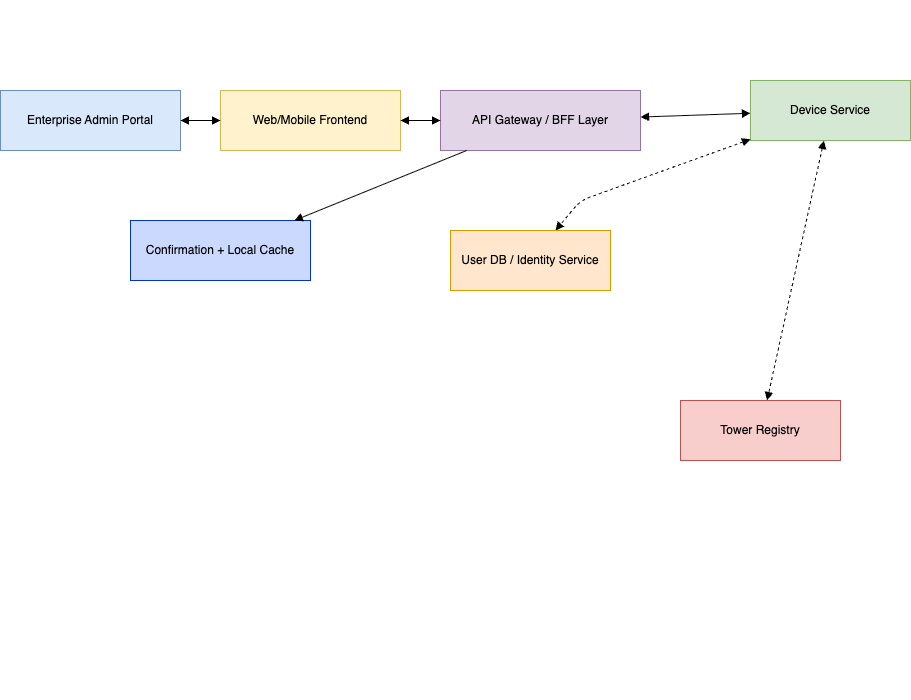

# 🗺️ Frontend Architecture Overview

This diagram presents the high-level architecture for the frontend system of the Telecom Mission Control SaaS platform. It is designed to support secure, scalable, and accessible enterprise-grade operations across both web and mobile platforms.

---

### 🔧 Layer-by-Layer Breakdown

#### 🖥️ Presentation Layer

- Composed of platform-specific UI components for web (React) and mobile (React Native).
- Designed for responsiveness across devices and accessibility compliance.

#### 📦 State Management Layer

- Uses Redux or MobX to maintain application state across screens and components.
- Manages UI state, offline queue state, and user session data consistently.

#### 🔁 API Orchestration Layer

- Centralizes communication with backend services.
- Responsible for retry logic, token refresh, caching, throttling, and fallback in offline mode.

#### 💾 Offline Handling

- Web uses **IndexedDB**, mobile uses **AsyncStorage**.
- Contains conflict resolution logic to merge offline user activity with server state after reconnection.
- Retry queue system ensures no data is lost when switching between offline and online.

#### 🌐 API Gateway Layer

- Interfaces between the frontend orchestration layer and backend microservices.
- Ensures consistent authentication, authorization, and API response shaping.

#### 🧠 Backend Services

- **Device Service**: Manages device registration, lookup, and association with users.
- **Policy Engine**: Enforces enterprise rules based on user role, app, action, and context.
- **Tower Registry**: Maintains a registry of nationwide telecom towers and their supported carriers.

#### 📡 Data Layer

- Includes persistent data storage (relational/NoSQL), logging/auditing pipelines, and asynchronous messaging (Kafka or RabbitMQ) for scale and observability.

---

### 🔒 Resilience & Accessibility

- The system supports offline-first usage, crucial for telecom environments with unstable connectivity.
- Though not depicted visually, the frontend is built with accessibility in mind (semantic HTML, ARIA roles, keyboard navigation, and screen reader compatibility).

---

### 📈 Scalability & Extensibility

- The architecture is modular, layered, and designed for multi-region deployments.
- Supports future additions like new device types, role policies, and app-level control modules.

## 🔁 Data Flow: Device + User Onboarding

This diagram represents the flow of onboarding a new user and device, including tower compatibility, identity registration, and frontend caching.

