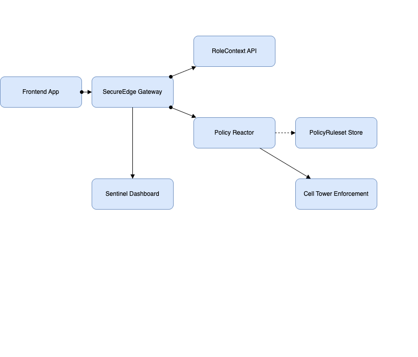

# 🔐 Policy Reactor – Enforcement Flow

This document outlines the flow of enforcing enterprise security policies in real-time through the **Policy Reactor** component of the Telecom Mission Control frontend system.

---

## 📊 Overview

## 🧩 Use Cases – Policy Reactor

It is invoked during runtime when a user interacts with an app via the frontend client and is subject to enforcement based on role, device, app, location, and policy.

---

## 🔁 Flow Diagram

---

## 🔧 Flow Steps

1. **Frontend App** initiates an action (e.g., upload file, access feature).
2. The **SecureEdge Gateway** forwards the request to the **Policy Reactor** and context services.
3. The **RoleContext API** supplies relevant identity and permission info.
4. The **Policy Reactor**:
   - Evaluates the policy for the user, role, app, and device context.
   - Fetches rules from the **PolicyRuleset Store**.
5. Based on rule evaluation:
   - ✅ Allows action
   - ❌ Denies action
   - 🔄 Triggers a remediation plan (e.g., disable feature, alert admin)
6. The **Cell Tower Enforcement** module is invoked if action must be blocked at the network level.
7. The **Sentinel Dashboard** logs the activity, outcome, and any audit details.

---

## 🔄 Bi-Directional Flows

- **Frontend ↔ Gateway**: Request/response for user interactions.
- **Gateway ↔ Policy Reactor**: Decision queries and outcomes.
- **Gateway ↔ RoleContext API**: Identity and role validation.

---

## 💼 Use Case: Role-Based Action Blocking

> A contractor using an Android device tries to install a network tool from the enterprise app store.

- The Policy Reactor identifies that the user's role doesn’t permit installation of restricted apps.
- It denies the request and logs the attempt in the dashboard.
- The cell tower is notified to prevent this device from future downloads of this type.

---

## 🧩 Components Involved

| Component              | Role                                       |
| ---------------------- | ------------------------------------------ |
| Frontend App           | UI for user actions                        |
| SecureEdge Gateway     | Secure API communication & orchestration   |
| RoleContext API        | Provides identity, device, and role info   |
| **Policy Reactor**     | Core engine to evaluate and enforce policy |
| PolicyRuleset Store    | Stores enterprise policy definitions       |
| Cell Tower Enforcement | Executes physical-level enforcement        |
| Sentinel Dashboard     | Logs policy decisions & violations         |

---

## 🌐 Accessibility & Scale

- Real-time policy enforcement even during degraded network
- Supports large-scale user bases with modular, distributed enforcement
- Designed with accessibility (WCAG) and offline-first principles
